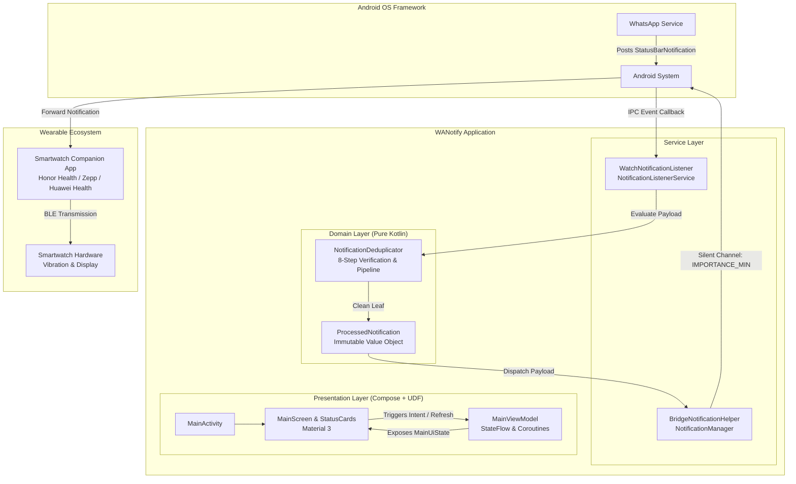

# WANotify

<p align="center">
  
</p>

<p align="center">
  <strong>High-performance Android notification bridge engineered to deliver clean, deduplicated WhatsApp alerts to smartwatches and wearable companion apps.</strong>
</p>

<p align="center">
  <a href="https://kotlinlang.org"></a>
  <a href="https://developer.android.com/about/versions/oreo"></a>
  <a href="https://developer.android.com"></a>
  <a href="https://developer.android.com/jetpack/compose"></a>
  <a href="https://opensource.org/licenses/MIT"></a>
  <a href="#test-coverage-and-quality-assurance"></a>
</p>

---

## 📌 Problem Statement & Engineering Motivation

Modern smartwatch companion applications (such as **Honor Health**, **Huawei Health**, **Zepp / Amazfit**, and **Garmin**) interface with incoming Android notifications by listening to the OS-level notification stream. However, syncing **WhatsApp** notifications reliably to wearables has been a persistent platform headache:

1. **Aggregated Bundle Summaries**: WhatsApp emits stacked summaries (e.g., *"3 new messages from 2 chats"*) alongside individual chat updates. Wearable apps routinely ingest these summary bundles as distinct messages, causing watches to vibrate repeatedly with useless generic notifications.
2. **Missing Group Chat Attribution**: In group conversations, WhatsApp updates the existing notification bundle with the full conversation history. Naive companion parsers frequently lose the leaf sender's name, displaying only the group title or an aggregated counter.
3. **Ghost & Duplicate Alerts**: Every time a user receives a new message, WhatsApp re-posts or mutates the notification for that entire thread. Wearable apps misinterpret these updates as brand-new alerts, causing annoying duplicate wrist vibrations for messages already read or notified.

**WANotify** solves this by acting as an intelligent middleware filter. It intercepts incoming WhatsApp notifications via an Android `NotificationListenerService`, traverses the nested `MessagingStyle` payload down to the atomic unread leaf message, applies a multi-stage concurrency-safe deduplication algorithm, and re-emits a pristine, silent notification specifically tailored for smartwatch ingestion.

---

## 🏗️ Architecture & System Design

WANotify is designed according to **Clean Architecture** principles and **Unidirectional Data Flow (UDF)**, maintaining strict separation of concerns across layers:



### Module & Package Breakdown

```
com.enesuzun2002.wanotify/
├── core/
│   ├── constants/
│   │   └── AppConstants.kt              # Channel IDs and target package definitions
│   └── utils/
│       └── PermissionUtils.kt           # Secure settings and power manager inspection
├── domain/
│   ├── filter/
│   │   └── NotificationDeduplicator.kt  # 8-step extraction & concurrency-safe dedup engine
│   └── model/
│       └── ProcessedNotification.kt     # Immutable domain entity with deterministic stableId
├── presentation/
│   ├── components/
│   │   └── StatusCard.kt                # Atomic reusable Material 3 state card
│   ├── MainScreen.kt                    # Declarative Compose configuration screen
│   └── MainViewModel.kt                 # Reactive state holder (StateFlow, atomic transitions)
├── service/
│   ├── BridgeNotificationHelper.kt      # Channel configuration (IMPORTANCE_MIN) & dispatch
│   └── WatchNotificationListener.kt     # Android NotificationListenerService lifecycle & IPC
├── ui/theme/                            # Material 3 design system (Type, Color, Theme)
└── MainActivity.kt                      # Edge-to-edge Compose host & permission orchestration
```

---

## ⚡ Deep Android Internals & Engineering Highlights

### 1. The 8-Step Notification Pipeline (`NotificationDeduplicator`)

The core filtering pipeline evaluates raw `StatusBarNotification` objects through an 8-stage verification pipeline before any notification is permitted to reach the smartwatch bridge:

1. **Package Verification**: Early rejection of any non-WhatsApp application package (`com.whatsapp`).
2. **Ongoing Event Suppression**: Rejection of active background tasks (`Notification.FLAG_ONGOING_EVENT`) such as active voice calls, ongoing audio recordings, and Google Drive backups.
3. **OS Group Summary Drop**: Direct suppression of Android system-level grouping containers (`Notification.FLAG_GROUP_SUMMARY`).
4. **Structural Sub-Summary Elimination**: Inspection of bundle extras for `Notification.EXTRA_SUMMARY_TEXT`.
5. **Template & MessagingStyle Verification**: Rejection of legacy `BigTextStyle` or `InboxStyle` fallbacks. Safe extraction of `NotificationCompat.MessagingStyle`.
6. **Leaf-Node Message Extraction**: Traversal of `MessagingStyle.messages` to extract strictly the most recent unread message leaf, verifying identity through `Person` metadata.
7. **Context-Aware Title Formatting**: Formats conversations dynamically:
   - Group chats with sender: `"Team Chat (Alice)"`
   - Group chats without individual sender: `"Team Chat"`
   - Direct chats: `"Alice"`
8. **Deduplication Checkpoint**: Evaluates the atomic leaf against a thread-safe sliding-window signature cache and enforces monotonic per-conversation timestamps.

```kotlin
// Example: Safe leaf extraction and attribution formatting
val latestMessage = messagingStyle.messages.last()
val text = latestMessage.text?.toString().orEmpty().trim()
val messageTime = latestMessage.timestamp

val rawTitle = resolveTitle(
    isGroupConversation = messagingStyle.isGroupConversation,
    conversationTitle = messagingStyle.conversationTitle?.toString().orEmpty(),
    senderName = latestMessage.person?.name?.toString().orEmpty(),
    fallbackTitle = extras.getCharSequence(Notification.EXTRA_TITLE)?.toString().orEmpty()
)
```

---

### 2. High-Concurrency Sliding-Window Deduplication

When a message arrives, WhatsApp frequently issues multiple rapid updates in identical or adjacent milliseconds. Furthermore, when a user reads a message, WhatsApp often updates the notification again.

WANotify implements an in-memory deduplication algorithm using `ConcurrentHashMap`:
- **Composite Conversation Key**: Formed by `sbn.tag ?: sbn.id.toString()`, guarding against cross-chat ID collisions when multiple conversations emit concurrently.
- **Sliding-Window Message Signature**: `$conversationKey-$messageTime-$text` cached with epoch timestamps. Signatures older than 10 seconds are automatically evicted, preventing memory leaks while stopping immediate burst duplicates.
- **Monotonic Timestamp Invariant**: Maintains `lastDeliveredTimestamps[conversationKey]`. Historical message leaves (timestamp < previous timestamp) are dropped immediately.

---

### 3. The Zero-Overhead Silent Bridge Pattern

To alert the smartwatch without creating dual vibrations or ringing on the smartphone, `BridgeNotificationHelper` isolates bridged notifications into an Android O+ `NotificationChannel`:

- **Importance**: `NotificationManager.IMPORTANCE_MIN` ensures zero sound, zero vibration, and no heads-up banners on the phone.
- **Lockscreen Masking**: `NotificationCompat.VISIBILITY_SECRET` keeps the bridge invisible on the lock screen.
- **No Badge Overhead**: `setShowBadge(false)` leaves app launcher badges untouched.
- **Clean Glyph**: Rendered using a dedicated monochrome vector asset (`R.drawable.ic_notification`).

Smartwatch companion applications listen to `NotificationManager` at the OS level and forward the sanitized title and message payload to the wearable via Bluetooth Low Energy (BLE).

---

### 4. Background Execution & Battery Governance

Android's Doze mode and aggressive OEM task killers (e.g. Huawei, Xiaomi, Honor) terminate background services aggressively. WANotify handles this through:
- Direct system intent helper launching `Settings.ACTION_REQUEST_IGNORE_BATTERY_OPTIMIZATIONS` with graceful fallback to `ACTION_APPLICATION_DETAILS_SETTINGS`.
- Declaration of `REQUEST_IGNORE_BATTERY_OPTIMIZATIONS` and `BIND_NOTIFICATION_LISTENER_SERVICE` permissions.
- Atomic state updates in `MainViewModel` utilizing `_uiState.update { ... }` without polling loops, preserving CPU and battery longevity.

---

## 📊 Technical Trade-Offs & Architecture Decisions

| Decision | Approach Chosen | Alternative Considered | Rationale |
|---|---|---|---|
| **Deduplication Storage** | In-Memory `ConcurrentHashMap` with TTL pruning | SQLite / Room Database | Microsecond access latency; zero disk I/O; notifications are ephemeral so memory caching is optimal. |
| **Wearable Sync Mechanism** | Silent OS Notification Channel Bridge | Custom Bluetooth GATT Server | Compatible with **all** wearable brands (Honor, Zepp, Garmin, Huawei) without reverse-engineering proprietary BLE protocols. |
| **Reactive State Pattern** | Kotlin `StateFlow` + UDF in ViewModel | LiveData / Polling Timer | Native coroutine support, lifecycle-aware collection in Compose, zero battery-draining polling loops. |
| **Chat Identity** | Composite `sbn.tag ?: sbn.id.toString()` | `sbn.id` only | Prevents collision bugs across independent chat threads on Android devices. |

---

## 🧪 Test Coverage and Quality Assurance

The core business and deduplication logic is decoupled from Android OS framework classes, enabling rapid JVM unit testing with JUnit:

```bash
./gradlew test
```

### Test Suite Highlights (`NotificationDeduplicatorTest`)
- ✔️ `first message from conversation is processed successfully`
- ✔️ `identical message within window is rejected as duplicate`
- ✔️ `stale message with older timestamp than last delivered is rejected`
- ✔️ `new message with subsequent timestamp in same conversation is accepted`
- ✔️ `independent conversations do not collide or block each other`
- ✔️ `expired signature after window threshold allows identical message`
- ✔️ `resolveTitle formats group conversation with sender correctly`
- ✔️ `resolveTitle formats direct conversation sender correctly`
- ✔️ `processedNotification stableId generates consistent non-zero hash`
- ✔️ `reset clears tracking caches and permits previously dropped duplicates`

---

## 🚀 Setup & User Guide

### 1. Build and Install
Compile and install the debug APK onto your Android device:
```bash
./gradlew assembleDebug
adb install app/build/outputs/apk/debug/app-debug.apk
```

### 2. Configure Permissions
1. Launch **WANotify**.
2. Tap **Grant Access** under **Notification Access** and enable WANotify in Android's *Notification Read & Control* settings.
3. Tap **Disable Restrictions** under **Battery Optimization** and select **Allow** to exempt WANotify from OS power killing.

### 3. Configure Companion App (Honor Health / Zepp / etc.)
1. Open your smartwatch companion app (e.g., **Honor Health**, **Zepp**, **Huawei Health**).
2. Go to **Device** &rarr; **Notifications**.
3. **Disable** notifications for **WhatsApp**.
4. **Enable** notifications for **WANotify**.
5. Enjoy clean, instant, single-vibration WhatsApp notifications on your watch!

---

## 🛠️ Tech Stack & Requirements

- **Language**: Kotlin 2.2.10
- **UI Framework**: Jetpack Compose (BOM 2026.02.01) with Material Design 3
- **Architecture**: Clean Architecture, Unidirectional Data Flow (UDF), MVVM
- **Concurrency**: Kotlin Coroutines, `StateFlow`, `ConcurrentHashMap`
- **Minimum SDK**: API 26 (Android 8.0 Oreo)
- **Target SDK**: API 37
- **Build System**: Gradle 9.7.1 with Android Gradle Plugin 9.3.2

---

## 📄 License

This project is licensed under the **MIT License** - see the [LICENSE](LICENSE) file for details.

```
MIT License
Copyright (c) 2026 Enes Uzun
```

---

## 👤 Author

**Enes Uzun**
- GitHub: [@enesuzun2002](https://github.com/enesuzun2002)
- Open to Android Engineering opportunities, collaborations, and discussions.
